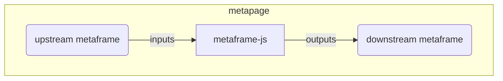

# Architecture

## How it works

metaframe-js runs user JavaScript modules embedded in the URL. The key design principle: **no state is stored on the server**.

- All code and configuration lives in the URL hash
- The server simply serves a static `index.html`
- The client extracts and runs the embedded JavaScript — code is never sent to the server
- Current URL length limits are large or not specifically limited in modern browsers

## Project structure

```
metaframe-js/
├── editor/          # React frontend (Vite + Chakra UI + TypeScript)
├── worker/          # Deno backend (Hono framework)
├── python/          # metaframe-widget Python package (anywidget)
├── examples/
│   ├── jupyter/     # Jupyter integration tests and examples
│   └── marimo/      # marimo integration tests and examples
├── test/            # Integration tests (Playwright + Vitest)
├── docs/            # This documentation site (VitePress)
├── docker-compose.yml
└── justfile         # Command runner
```

## Metaframes and metapages

This website is a [metaframe](https://docs.metapage.io/docs/what-is-a-metaframe): a self-contained web application that communicates via inputs and outputs. Connect metaframes together into apps, workflows, and dashboards called [metapages](https://docs.metapage.io/docs).



## URL state management

State is encoded in the URL hash using [@metapages/hash-query](https://www.npmjs.com/package/@metapages/hash-query). The editor uses React hooks (`useHashParamBase64`, `useHashParamJson`) to read and write hash parameters.

See [URL State](../guide/url-state) for the JavaScript API.
