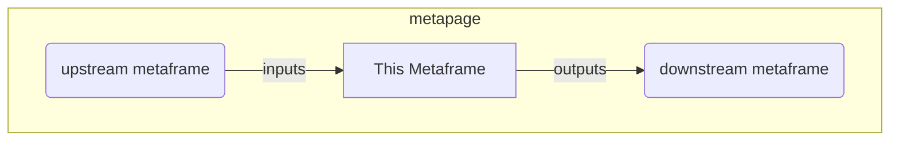

# Examples

Live metapage examples showing metaframe-js in action:

- [Visualize and change network connections](https://metapage.io/m/192e16b132874757b9d55a77a63078d7)
- [Use any visualization module](https://metapage.io/m/69e1418a17ca4ea8a8dd8b9e8a5aa495)
- [Display any kind of table or tabular data](https://metapage.io/m/c62d0f7a16ce4d5b858ad18af8ec5014)
- [Animation, shaders, 3D](https://metapage.io/m/5458bbc3948046f9b2aa2e4e08f0c255)
- [AI-generated example result](https://metapage.io/m/800c916ed9204dec93db7119f9985d76) — made by copying the AI prompt into ChatGPT

## Connecting metaframes

metaframe-js is a [metaframe](https://docs.metapage.io/docs/what-is-a-metaframe): connect metaframes together into apps, workflows, and dashboards via [metapages](https://docs.metapage.io/docs).

