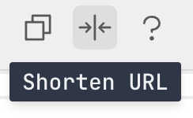

# Short URLs

Since all code and state is stored in the URL hash, metaframe URLs can get very long. The built-in URL shortener compresses these into compact, shareable links.

## How it works

1. Click the **shorten** button in the editor header 
2. The current hash parameters (code, inputs, options) are stored in [R2](https://www.cloudflare.com/developer-platform/products/r2/) 
4. You get a short URL `js.mtfm.io/j/<SHA256-based short ID>` e.g:

```
https://js.mtfm.io/j/8a3b1c9f...
```

The short URL is automatically copied to your clipboard.

The content is immutable and we currently have no plans to expire the content. Possibly the large blobs may eventually be expired, but the code likely never. If the blobs ever do expire, it will be a human comfortable length of time: at least a month.

## Example

A full URL like this:

```
https://js.mtfm.io/#?js=Y29uc3QgZGl2ID0gZG9jdW1lbnQuY3Jl...&options=eyJhdXRvcnVuIjp0cnVlfQ%3D%3D
```

Becomes:

```
https://js.mtfm.io/j/8a3b1c9f4e2d7a6b5c8d9e0f1a2b3c4d5e6f7a8b9c0d1e2f3a4b5c6d7e8f9a0b
```

When someone opens the short URL, the page loads with all the original code and state intact — no redirect, the browser stays on the `/j/...` path.

## API

You can also shorten URLs programmatically.

### Shorten from hash params

```bash
curl -X POST https://js.mtfm.io/api/shorten \
  -H "Content-Type: application/json" \
  -d '{"hashParams": "?js=Y29uc29sZS5sb2coImhlbGxvIik%3D"}'
```

Response:

```json
{
  "success": true,
  "id": "8a3b1c9f...",
  "path": "/j/8a3b1c9f..."
}
```

### Shorten from JSON

A convenience endpoint that encodes JavaScript and options into hash params for you:

```bash
curl -X POST https://js.mtfm.io/api/shorten/json \
  -H "Content-Type: application/json" \
  -d '{"js": "console.log(\"hello\")"}'
```

Response:

```json
{
  "id": "8a3b1c9f...",
  "shortUrl": "https://js.mtfm.io/j/8a3b1c9f...",
  "fullUrl": "https://js.mtfm.io/#?js=Y29uc29sZS5sb2coImhlbGxvIik%3D",
  "hashParams": "?js=Y29uc29sZS5sb2coImhlbGxvIik%3D"
}
```

### Retrieve hash params

```bash
curl https://js.mtfm.io/api/j/8a3b1c9f...
```

Response:

```json
{
  "id": "8a3b1c9f...",
  "hashParams": "?js=Y29uc29sZS5sb2coImhlbGxvIik%3D"
}
```

::: tip
Short URLs are content-addressed — the same code always produces the same short URL. They never expire.
:::
