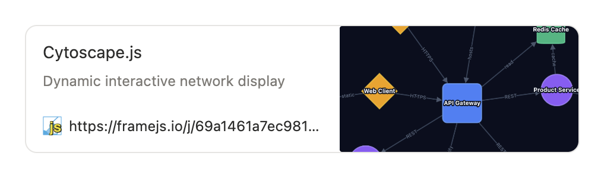

# What is framejs.io?

[framejs.io](https://framejs.io) is an embeddable, editable web app. 

It is designed for embedding code safely anywhere, creating custom, editable dashboards, widgets, notebook components, shareable visualizations, editable apps, and more. It is open-source, and aims to be a user-centric web primitive.

<p class="feature-link"><a href="/docs/examples/">Examples &rarr;</a></p>

# Features

<div class="features-page">

## Create with AI

Describe what you want in plain language — visualizations, dashboards, apps, games — and AI builds it for you. Works with Claude, ChatGPT, or any LLM.

```
/js show a range of ways of visualization using this platform with a slider
```

<div class="feature-embed">
<iframe
  src="https://framejs.io/j/8e5d5eed5c3fda9c5094b186169feadecde2bf007fcd58b7fa0df52e3e3c34be"
  width="100%"
  height="350"
  frameborder="0"
  style="border: 1px solid var(--vp-c-border); border-radius: 8px;"
  allow="clipboard-read; clipboard-write"
></iframe>
</div>

<p class="feature-link"><a href="/docs/ai/setup">Set up AI editing &rarr;</a></p>

---

## Embed Anywhere

Paste a URL into any platform that supports embeds — Notion, Obsidian, Confluence, Google Docs, Jupyter notebooks, your own website. It just works.

```html
<iframe src="https://framejs.io/j/9af8d1c..." width="100%" height="400"></iframe>
```

<div class="embed-targets">
  <div class="embed-target">Notion</div>
  <div class="embed-target">Obsidian</div>
  <div class="embed-target">Confluence</div>
  <div class="embed-target">Jupyter</div>
  <div class="embed-target">Any website</div>
</div>

<p class="feature-link"><a href="/docs/guide/embedding">Embedding guide &rarr;</a></p>

---

## Open Graph Previews

Links render with a title, description, and preview image in Slack, Discord, social media, and anywhere else that supports Open Graph. Set these in the editor's Settings panel.

<div class="og-preview-card">
  <div class="og-image-placeholder">
    
  </div>
</div>

<p class="feature-link"><a href="/docs/guide/embedding#open-graph-link-previews">Open Graph details &rarr;</a></p>

---

## Share via Links

All code and state lives in the URL. Copy it, send it, bookmark it — anyone with the link can run your code. Use short URLs for cleaner sharing.

<div class="url-examples">
  <div class="url-example">
    <span class="url-label">Full URL</span>
    <code>https://framejs.io/#?js=...</code>
  </div>
  <div class="url-example">
    <span class="url-label">Short URL</span>
    <code>https://framejs.io/j/8e5d5eed5c...</code>
  </div>
</div>

::: tip No accounts, no servers
There is no login. The URL *is* the program. Short URLs are immutable content-addressed hashes — they never change or expire.
:::

<p class="feature-link"><a href="/docs/guide/short-urls">Short URLs &rarr;</a></p>

---

## Connect Inputs and Outputs

Wire metaframes together. One metaframe's output becomes another's input. Build pipelines, dashboards, and multi-step workflows by connecting them in a [metapage](https://metapage.io).

```javascript
// Send data out
setOutput("result", { temperature: 72, unit: "F" });

// Receive data in
export function onInputs(inputs) {
  const data = inputs["sensorData"];
  // process and visualize
}
```

<p class="feature-link"><a href="/docs/guide/javascript-api#inputs-and-outputs">I/O API reference &rarr;</a></p>

---

## Edit in the Browser

A full code editor runs in the browser. Write JavaScript, add npm modules and CSS, configure settings — all without leaving the page. Changes update the URL in real time.

<div class="editor-features">
  <div class="editor-feature">ES6 modules with top-level <code>await</code></div>
  <div class="editor-feature">Import any npm package from CDN</div>
  <div class="editor-feature">Add CSS stylesheets</div>
  <div class="editor-feature">Live preview as you type</div>
  <div class="editor-feature">Settings panel for inputs, outputs, and Open Graph</div>
</div>

<div class="feature-embed">
<iframe
  src="https://framejs.io/#?edit=true"
  width="100%"
  height="400"
  frameborder="0"
  style="border: 1px solid var(--vp-c-border); border-radius: 8px;"
  allow="clipboard-read; clipboard-write"
></iframe>
</div>

<p class="feature-link"><a href="/docs/guide/javascript-api">JavaScript API &rarr;</a></p>

</div>

<style>
.features-page h2 {
  margin-top: 2rem;
}

.feature-embed {
  margin: 16px 0;
}

.feature-link {
  margin-top: 8px;
}

.feature-link a {
  color: var(--vp-c-brand-1);
  font-weight: 500;
}

.embed-targets {
  display: flex;
  flex-wrap: wrap;
  gap: 10px;
  margin: 16px 0;
}

.embed-target {
  background: var(--vp-c-bg-soft);
  border: 1px solid var(--vp-c-border);
  border-radius: 6px;
  padding: 8px 16px;
  font-size: 14px;
  font-weight: 500;
}

.og-preview-card {
  margin: 16px 0;
  max-width: 500px;
}

.og-preview-card img {
  width: 100%;
  border-radius: 8px;
  border: 1px solid var(--vp-c-border);
}

.url-examples {
  display: flex;
  flex-direction: column;
  gap: 8px;
  margin: 16px 0;
}

.url-example {
  display: flex;
  align-items: center;
  gap: 12px;
}

.url-label {
  font-size: 13px;
  font-weight: 600;
  color: var(--vp-c-text-2);
  min-width: 70px;
}

.url-example code {
  font-size: 13px;
}

.editor-features {
  display: flex;
  flex-wrap: wrap;
  gap: 8px;
  margin: 16px 0;
}

.editor-feature {
  background: var(--vp-c-bg-soft);
  border: 1px solid var(--vp-c-border);
  border-radius: 6px;
  padding: 6px 12px;
  font-size: 13px;
}
</style>


---

## JavaScript overview

- Code is an ES6 module
- Top-level `await` is supported
- Export `onInputs` to listen to inputs from connected metaframes
- Send outputs with `setOutput` / `setOutputs`
- Export `onResize` to handle window/div resizes
- Use ES6 module imports, or add CSS / npm modules — everything is embedded in the URL

See the full [JavaScript API](./guide/javascript-api) for details.