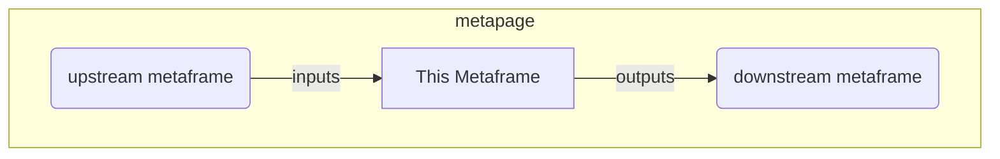

# Javascript embedded in the URL: run and edit with AI tools

<a href="https://github.com/metapages/metaframe-js" target="_top" rel="noopener noreferrer">Github</a>


Edit and run javascript code in the browser. Share and connect the self-contained websites with other chunks of code and visualization.

Copy and paste into AI such as Claude Code or ChatGPT and create shareable code that will always run.

## Edit with AI

1. Copy the AI prompt, paste into e.g. Claude Code or ChatGPT, the ask what you want
 

2. Copy the result back to the Javascript window. Now you have something to share or embed

<a href="https://metapage.io/m/800c916ed9204dec93db7119f9985d76" target="_top" rel="noopener noreferrer">View the result!</a>

## Examples


  - <a href="https://metapage.io/m/192e16b132874757b9d55a77a63078d7" target="_top" rel="noopener noreferrer">Visualize change network connections</a>
  - <a href="https://metapage.io/m/69e1418a17ca4ea8a8dd8b9e8a5aa495" target="_top" rel="noopener noreferrer">Use any visualization module</a>
  - <a href="https://metapage.io/m/c62d0f7a16ce4d5b858ad18af8ec5014" target="_top" rel="noopener noreferrer">Display any kind of table or tabular data</a>
  - <a href="https://metapage.io/m/5458bbc3948046f9b2aa2e4e08f0c255" target="_top" rel="noopener noreferrer">Animation, shaders, 3D</a>


## Javascript high level

 - code is an es6 module 
 - top-level `await`
 - export a function `onInputs` to listen to inputs
 - send outputs with `setOutput`/`setOutputs` (predefined functions available in your module)
 - export a function `onResize` to listen to window/div resizes
 - use es6 module imports, or add any css / npm modules to the page, they are embedded in the URL

## Useful code snippets

### Handling Inputs and outputs in code

Simply export a function (arrow function also good 👍) called `onInputs`:

```javascript
// regular js function
export function onInputs(inputs) {
  // do something here
  // inputs is a plain object (key and values)
}
//  OR arrow function
export const onInputs = (inputs) => {
  // do something here
  // inputs is a plain object (key and values)
}
```

To send outputs, there are two functions in the scope `setOutput` and `setOutputs`:

```javascript
// send a single JSON output
setOutput("outputname", 42);

// send an output object of keys+values
setOutputs({
  outputname:true,
  someOtherOutputName: "bar",
});
```

Output values can be strings, JSON, objects, arrays, numbers, ArrayBuffers, typed arrays such as `Uint8Array`;

### Define Inputs and Outputs

In `Settings` you can define inputs and outputs. This doesn't change how the code runs, but it allows much easier connecting upstream and downstream metaframes when editing <a href="https://metapage.io" target="_top" rel="noopener noreferrer">metapages</a>.


In this example, we defined an input: `input.json` and an output `data.csv`:


You will see these inputs and outputs automatically in the metapage editor.

### The root display div element is exposed in the scope

The root display div is exposed in the script scope: the name is `root` and the id is also `root`:

```javascript
console.log(root.id)
// logs "root"
// Add any custom dome elements into "root".
```

You can also just get it with:
```javascript
document.getElementById("root")
```

### Height / width / window resize

To get the root element width/height:

```javascript
const width = root.getBoundingClientRect().width;
const height = root.getBoundingClientRect().height;
```


For automatically resizing: export a function (arrow function also good 👍) called `onResize`. This will be called when either the window resizes event and/or the local `div` element resizes:

```javascript
// regular js function
export function onResize(width, height) {
  // Your own code here, handling the resize of the root div
}
//  OR arrow function
export const onResize = (width, height) => {
  // Your own code here, handling the resize of the root div
}
```

### Prevent scroll events from propagating to the parent window

Often if you use (wheel) scroll events to interact with content, the event is also propagated to the parent window, scrolling the entire metapage, which is almost always undesired.

To prevent this, on the dom element you intercept wheel scroll events, add this code to prevent the event from propagating up. Replace `myContainer` with your dom element:

```javascript
// prevent parent from scrolling when zooming
function maybeScroll(event) {
  if (myContainer.contains(event.target)) {
    event.preventDefault();
  } 
}
window.addEventListener('wheel', maybeScroll, {passive: false})
```

### Save state in the URL

State is stored in the URL, you can get and set values using the [@metapages/hash-query](https://www.npmjs.com/package/@metapages/hash-query) module:

```javascript
import {
  getHashParamsFromWindow,
  getHashParamFromWindow,
  getHashParamValueJsonFromWindow,
  setHashParamValueJsonInWindow,
  setHashParamValueBase64EncodedInWindow,
  getHashParamValueBase64DecodedFromWindow,
} from 'https://cdn.jsdelivr.net/npm/@metapages/hash-query@0.9.12/+esm';

// Get JSON stored in URL
const myJsonBlob = getHashParamValueJsonFromWindow("someKey") || {};
// update the JSON blob
myJsonBlob["someKey"] = "foobar";
// set it back in the URL
setHashParamValueJsonInWindow("someKey", myJsonBlob)
// delete it if needed
deleteHashParamFromWindow("someKey")
```

Note: this is to store relatively small values. Huge multi-megabyte JSON blobs are not yet supported, but we have a plan wtoill support large blobs.


### Unload/cleanup

When iterating with the code editor, the script is re-run. In some cases, this can cause problems as multiple listeners maybe responding to the same event.

This is not an issue when simply running the page once with code, only when develping iteratively.

To have your script cleaned up because of new script (when editing), declare a function `cleanup`, this will be called prior to the updated script re-running:

```javascript
// regular js function
export function cleanup() {
	console.log("internal scriptUnload call")
	// do your cleanup here
}
// OR arrow function
export const cleanup = () => {
  // do your cleanup here
}
```

### Wait until page `load`

You don't need to wait for the `load` event: your script will not run until `load` event fires.

### Logging to the display (instead of console)

Some globally available functions for logging:

```javascript

  log("something here");
  logStdout("something here");
  logStderr("an error");

```

These will be added to the root div (see below) so if your own code manipulates the root div, it could be overwritten. This is mostly useful for headless code.

### Misc

 - `"use strict"` is automatically added to the top of the module code.


## Longer description and archtecture

Run arbitrary user javascript modules embedded in the URL. Designed for <a href="https://metapage.io" target="_top" rel="noopener noreferrer">metapages</a> so you can connect inputs + outputs to other metaframe URLs. Similar to <a href="https://codepen.io/" target="_top" rel="noopener noreferrer">Codepen</a>, <a href="https://jsfiddle.net/" target="_top" rel="noopener noreferrer">JSFiddle</a>, but completely self-contained and does not require an active server, these is a simple tiny static website.


### Connect upstream/downstream metaframes



### Connecting with other chunks of code and visualization

This website is also a <a href="https://docs.metapage.io/docs/what-is-a-metaframe" target="_top" rel="noopener noreferrer">metaframe</a>: connect metaframes together into apps/workflows/dashboards: [metapages](https://docs.metapage.io/docs)

### Architecture


 - no state is stored on the server (all embedded in the URL)
   - this imposes some limits but current URL lengths are large or not specifically limited
 - The server simply serves a little `index.html`
 - The client then runs the embedded javascript (the javascript code is **not** sent to the server)

The server runs on https://deno.com/deploy which is

 - simple
 - fast
 - very performant
 - deploys immediately with a simply push to the repository
 - 🌟🌟🌟🌟🌟
