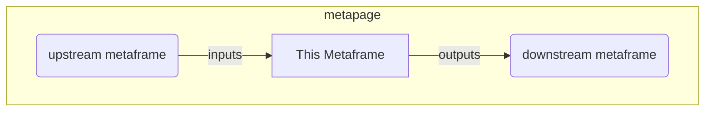

# Javascript embedded in the URL: run and edit with AI tools

[Official Docs](https://js.mtfm.io/docs)

<a href="https://github.com/metapages/metaframe-js" target="_top" rel="noopener noreferrer">Github</a>

Edit and run javascript code in the browser. Share and connect the self-contained websites with other chunks of code and visualization.

Copy and paste into AI such as Claude Code or ChatGPT and create shareable code that will always run.

## Edit with AI

1. Copy the AI prompt, paste into e.g. Claude Code or ChatGPT, the ask what you want
   

2. Copy the result back to the Javascript window. Now you have something to share or embed

<a href="https://metapage.io/m/800c916ed9204dec93db7119f9985d76" target="_top" rel="noopener noreferrer">View the result!</a>

## Examples

- <a href="https://metapage.io/m/192e16b132874757b9d55a77a63078d7" target="_top" rel="noopener noreferrer">Visualize change network connections</a>
- <a href="https://metapage.io/m/69e1418a17ca4ea8a8dd8b9e8a5aa495" target="_top" rel="noopener noreferrer">Use any visualization module</a>
- <a href="https://metapage.io/m/c62d0f7a16ce4d5b858ad18af8ec5014" target="_top" rel="noopener noreferrer">Display any kind of table or tabular data</a>
- <a href="https://metapage.io/m/5458bbc3948046f9b2aa2e4e08f0c255" target="_top" rel="noopener noreferrer">Animation, shaders, 3D</a>

## Javascript high level

- code is an es6 module
- top-level `await`
- export a function `onInputs` to listen to inputs
- send outputs with `setOutput`/`setOutputs` (predefined functions available in your module)
- export a function `onResize` to listen to window/div resizes
- use es6 module imports, or add any css / npm modules to the page, they are embedded in the URL

## Useful code snippets

### Handling Inputs and outputs in code

Simply export a function (arrow function also good 👍) called `onInputs`:

```javascript
// regular js function
export function onInputs(inputs) {
  // do something here
  // inputs is a plain object (key and values)
}
//  OR arrow function
export const onInputs = (inputs) => {
  // do something here
  // inputs is a plain object (key and values)
};
```

To send outputs, there are two functions in the scope `setOutput` and `setOutputs`:

```javascript
// send a single JSON output
setOutput("outputname", 42);

// send an output object of keys+values
setOutputs({
  outputname: true,
  someOtherOutputName: "bar",
});
```

Output values can be strings, JSON, objects, arrays, numbers, ArrayBuffers, typed arrays such as `Uint8Array`;

### Define Inputs and Outputs

In `Settings` you can define inputs and outputs. This doesn't change how the code runs, but it allows much easier connecting upstream and downstream metaframes when editing <a href="https://metapage.io" target="_top" rel="noopener noreferrer">metapages</a>.

In this example, we defined an input: `input.json` and an output `data.csv`:


You will see these inputs and outputs automatically in the metapage editor.

### The root display div element is exposed in the scope

The root display div is exposed in the script scope: the name is `root` and the id is also `root`:

```javascript
console.log(root.id);
// logs "root"
// Add any custom dome elements into "root".
```

You can also just get it with:

```javascript
document.getElementById("root");
```

### Height / width / window resize

To get the root element width/height:

```javascript
const width = root.getBoundingClientRect().width;
const height = root.getBoundingClientRect().height;
```

For automatically resizing: export a function (arrow function also good 👍) called `onResize`. This will be called when either the window resizes event and/or the local `div` element resizes:

```javascript
// regular js function
export function onResize(width, height) {
  // Your own code here, handling the resize of the root div
}
//  OR arrow function
export const onResize = (width, height) => {
  // Your own code here, handling the resize of the root div
};
```

### Prevent scroll events from propagating to the parent window

Often if you use (wheel) scroll events to interact with content, the event is also propagated to the parent window, scrolling the entire metapage, which is almost always undesired.

To prevent this, on the dom element you intercept wheel scroll events, add this code to prevent the event from propagating up. Replace `myContainer` with your dom element:

```javascript
// prevent parent from scrolling when zooming
function maybeScroll(event) {
  if (myContainer.contains(event.target)) {
    event.preventDefault();
  }
}
window.addEventListener("wheel", maybeScroll, { passive: false });
```

### Save state in the URL

State is stored in the URL, you can get and set values using the [@metapages/hash-query](https://www.npmjs.com/package/@metapages/hash-query) module:

```javascript
import {
  getHashParamsFromWindow,
  getHashParamFromWindow,
  getHashParamValueJsonFromWindow,
  setHashParamValueJsonInWindow,
  setHashParamValueBase64EncodedInWindow,
  getHashParamValueBase64DecodedFromWindow,
} from "https://cdn.jsdelivr.net/npm/@metapages/hash-query@0.9.12/+esm";

// Get JSON stored in URL
const myJsonBlob = getHashParamValueJsonFromWindow("someKey") || {};
// update the JSON blob
myJsonBlob["someKey"] = "foobar";
// set it back in the URL
setHashParamValueJsonInWindow("someKey", myJsonBlob);
// delete it if needed
deleteHashParamFromWindow("someKey");
```

Note: this is to store relatively small values. Huge multi-megabyte JSON blobs are not yet supported, but we have a plan wtoill support large blobs.

### Unload/cleanup

When iterating with the code editor, the script is re-run. In some cases, this can cause problems as multiple listeners maybe responding to the same event.

This is not an issue when simply running the page once with code, only when develping iteratively.

To have your script cleaned up because of new script (when editing), declare a function `cleanup`, this will be called prior to the updated script re-running:

```javascript
// regular js function
export function cleanup() {
  console.log("internal scriptUnload call");
  // do your cleanup here
}
// OR arrow function
export const cleanup = () => {
  // do your cleanup here
};
```

### Wait until page `load`

You don't need to wait for the `load` event: your script will not run until `load` event fires.

### Logging to the display (instead of console)

Some globally available functions for logging:

```javascript
log("something here");
logStdout("something here");
logStderr("an error");
```

These will be added to the root div (see below) so if your own code manipulates the root div, it could be overwritten. This is mostly useful for headless code.

### Misc

- `"use strict"` is automatically added to the top of the module code.

## Jupyter Notebook Widget

Use any metaframe as an interactive Jupyter notebook widget. Install the `metaframe-widget` package:

```bash
pip install metaframe-widget
```

### Basic usage

```python
from metaframe_widget import MetaframeWidget

# From a URL — paste any metaframe URL
w = MetaframeWidget(url="https://js.mtfm.io/#?js=...")
w  # renders the iframe in the notebook
```

### Create from inline code

```python
w = MetaframeWidget.from_code("""
export const onInputs = (inputs) => {
    document.getElementById("root").textContent = JSON.stringify(inputs);
    setOutput("echo", inputs);
};
""")
w
```

### Push inputs from Python

```python
w.set_inputs({"data": [1, 2, 3], "message": "hello from Python"})
w.set_input("count", 42)
```

### Read and react to outputs

```python
# Read current outputs
print(w.outputs)

# React to output changes
w.on_outputs_change(lambda change: print("Got:", change["new"]))
```

### Pipe widgets together

Connect the output of one widget to the input of another:

```python
source = MetaframeWidget.from_code("...")
sink = MetaframeWidget.from_code("...")

# When source emits "doubled", push it to sink's "data" input
source.pipe_to(sink, output_key="doubled", input_key="data")
```

Works in Jupyter, JupyterLab, VS Code, Colab, and marimo.

### marimo

In [marimo](https://marimo.io), wrap the widget with `mo.ui.anywidget()` to get reactive bindings:

```python
import marimo as mo
from metaframe_widget import MetaframeWidget

w = mo.ui.anywidget(MetaframeWidget(url="https://js.mtfm.io/"))
w
```

Then in a separate cell, `w.outputs` will reactively update when the metaframe emits output — any cell referencing it re-runs automatically.

```python
w.set_inputs({"data": [1, 2, 3]})
```

For piping, access the underlying widget via `.widget`:

```python
source.widget.pipe_to(sink.widget, output_key="result", input_key="data")
```

See `examples/marimo/demo.py` in the repo for a complete example.

## Sharing: Copy URL and Shorten URL

The editor toolbar has two sharing buttons:

- **Copy URL** — copies the full URL (with all code, config, and inputs in the hash) to your clipboard
- **Shorten URL** — creates a compact `/j/{sha256}` short URL and copies it to your clipboard

Both buttons capture a **snapshot** of the current state, including:

- Your JavaScript code
- All current **inputs** (the values most recently received by `onInputs`)
- Module imports, definition, options, and other configuration

This means the shared URL is a frozen point-in-time copy. If inputs change after you copy/shorten, the URL still contains the values from the moment you clicked the button. Anyone who opens the URL gets exactly the same code running with exactly the same input data.

### Full URL vs short URL

**Full URL** (everything embedded in the hash):

```
https://js.mtfm.io/#?js=ZXhwb3J0IGNvbnN0IG9uSW5wdXRzID0gKGlucHV0cykgPT4gew0KICAgIGRvY3VtZW50LmdldEVsZW1lbnRCeUlkKCJyb290IikudGV4dENvbnRlbnQgPSBKU09OLnN0cmluZ2lmeShpbnB1dHMpOwp9&inputs=%7B%22data.json%22%3A%7B%22type%22%3A%22url%22%2C%22value%22%3A%22https%3A%2F%2Fjs.mtfm.io%2Ff%2Fabc123%22%7D%7D
```

**Short URL** (same content, compact):

```
https://js.mtfm.io/j/e3b0c44298fc1c149afbf4c8996fb92427ae41e4649b934ca495991b7852b855
```

Short URLs are content-addressed: the path is `/j/{sha256}` where the SHA-256 is computed from the hash parameters. Identical content always produces the same short URL.

### Programmatic shortening

**From raw hash params:**

```bash
curl -X POST https://js.mtfm.io/api/shorten \
  -H "Content-Type: application/json" \
  -d '{"hashParams": "?js=ZXhwb3J0IGNvbnN0IG9uSW5wdXRzID0gKGlucHV0cykgPT4ge30%3D"}'
```

**From structured JSON (preferred):**

```bash
curl -X POST https://js.mtfm.io/api/shorten/json \
  -H "Content-Type: application/json" \
  -d '{
    "js": "export const onInputs = (inputs) => { root.textContent = JSON.stringify(inputs); }",
    "inputs": {
      "data.json": { "type": "url", "value": "https://js.mtfm.io/f/abc123def456..." }
    }
  }'
```

Response:

```json
{
  "id": "e3b0c44298fc1c14...",
  "shortUrl": "https://js.mtfm.io/j/e3b0c44298fc1c14...",
  "fullUrl": "https://js.mtfm.io/#?js=...&inputs=...",
  "hashParams": "?js=...&inputs=..."
}
```

Supported fields in `/api/shorten/json`: `js`, `inputs`, `definition`, `modules`, `options`.

## File system

Files uploaded to js.mtfm.io are stored in a content-addressed file system. Every file is identified by its SHA-256 hash and accessible at a permanent URL.

### URL schema

```
https://js.mtfm.io/f/{sha256}
```

For example:

```
https://js.mtfm.io/f/a1b2c3d4e5f67890abcdef1234567890abcdef1234567890abcdef1234567890
```

You can access any uploaded file directly by visiting its `/f/{sha256}` URL in a browser or fetching it programmatically. The file is served with its original content type.

### Uploading files

Upload files by **dragging them onto the editor** or by adding file-type inputs in Settings. The upload flow:

1. The client computes a SHA-256 hash of the file content
2. A presigned upload URL is requested from `POST /api/upload/presign`
3. The file is uploaded directly to S3 via the presigned URL
4. The file becomes accessible at `https://js.mtfm.io/f/{sha256}`

### Accessing files in code

Uploaded files appear as inputs to your code. Fetch them directly or receive them via `onInputs`:

```javascript
// Option 1: Receive files via onInputs (automatic when files are in inputs)
export const onInputs = (inputs) => {
  // JSON files are auto-parsed into objects
  const data = inputs["data.json"];
  // Images and other binary files arrive as Blobs
  const image = inputs["photo.jpg"];
};

// Option 2: Fetch a file directly by its URL
const response = await fetch("https://js.mtfm.io/f/a1b2c3d4e5f6...");
const data = await response.json(); // or .text(), .blob(), .arrayBuffer()
```

### File references in inputs

Uploaded files are added to the `inputs` hash parameter as DataRef objects with `type: "url"`:

```json
{
  "inputs": {
    "photo.jpg": {
      "type": "url",
      "value": "https://js.mtfm.io/f/a1b2c3d4e5f6..."
    },
    "data.csv": {
      "type": "url",
      "value": "https://js.mtfm.io/f/f6e5d4c3b2a1..."
    }
  }
}
```

When the code runs, the runtime fetches each URL and delivers the content to your `onInputs` function. JSON files are automatically parsed into objects; other types arrive as Blobs.

### DataRef types

Inputs support several reference types:

| Type     | Value                 | Resolved to                                                              |
| -------- | --------------------- | ------------------------------------------------------------------------ |
| `url`    | A URL string          | Fetched content (JSON object, string, or Blob depending on content-type) |
| `utf8`   | Plain text            | String                                                                   |
| `base64` | Base64-encoded binary | Blob                                                                     |
| `json`   | A JSON value          | The value as-is                                                          |
| (none)   | Any value             | Treated as native JSON                                                   |

### Example: upload a file and create a short URL

```bash
# 1. Upload a file
SHA=$(shasum -a 256 mydata.json | cut -d' ' -f1)
PRESIGN=$(curl -s -X POST https://js.mtfm.io/api/upload/presign \
  -H "Content-Type: application/json" \
  -d "{\"contentType\": \"application/json\", \"fileSize\": $(stat -f%z mydata.json), \"sha256\": \"$SHA\"}")
curl -X PUT "$(echo $PRESIGN | jq -r .presignedUrl)" \
  -H "Content-Type: application/json" \
  --data-binary @mydata.json

# 2. Create a short URL that references the uploaded file
curl -X POST https://js.mtfm.io/api/shorten/json \
  -H "Content-Type: application/json" \
  -d "{
    \"js\": \"export const onInputs = (inputs) => { root.textContent = JSON.stringify(inputs); }\",
    \"inputs\": {
      \"mydata.json\": { \"type\": \"url\", \"value\": \"https://js.mtfm.io/f/$SHA\" }
    }
  }"
```

## Data persistence and storage lifetime

### Code is stored forever

All code and configuration stored via URL shortening (`/j/{sha256}`) are **persisted indefinitely**. Every short URL you create is permanent — it will continue to resolve for as long as the service is running.

This means:

- Every version of your code that you shorten is preserved forever
- You can always go back to any previously shared short URL
- Since storage is content-addressed (keyed by SHA-256), identical content is automatically deduplicated — shortening the same code twice produces the same URL, not a duplicate

Full URLs (with code in the hash) are also permanent by nature since they carry their own data — they don't depend on any server storage at all.

### Uploaded files (planned: 1 month expiry)

Files uploaded via `/f/{sha256}` are currently stored without expiration, but **file expiry of approximately 1 month is planned**. Once enabled, files that have not been re-uploaded will be removed after roughly 30 days.

This gives you plenty of time to transfer blobs to your own storage if you are building on top of this platform. The recommended workflow:

1. Upload files and create short URLs as needed
2. If you want permanent file hosting, copy the blobs from `https://js.mtfm.io/f/{sha256}` to your own S3/CDN/storage
3. Update the `inputs` in your short URL (or your own stored URL) to point to your permanent file URLs instead

### Summary

| What                      | Path format   | Persistence                             |
| ------------------------- | ------------- | --------------------------------------- |
| Short URL (code + config) | `/j/{sha256}` | **Forever**                             |
| Full URL (hash params)    | `/#?js=...`   | **Forever** (self-contained, no server) |
| Uploaded file             | `/f/{sha256}` | ~1 month (planned), currently no expiry |

If a short URL references uploaded files via `/f/...` URLs and those files expire, the short URL itself will still resolve but the file fetches will fail. To avoid this, either re-upload files periodically or migrate them to your own storage.

## URL format reference

### Page URLs

| URL pattern          | Description                                                            |
| -------------------- | ---------------------------------------------------------------------- |
| `/#?js={base64}&...` | Full URL with code and config embedded in the hash                     |
| `/j/{sha256}`        | Short URL — resolves to the same content as the full URL               |
| `/f/{sha256}`        | Uploaded file — directly accessible, served with original content type |

### Hash parameters

The full URL format is:

```
https://js.mtfm.io/#?js={base64}&inputs={json}&modules={json}&definition={json}&options={json}&edit={bool}
```

| Parameter     | Encoding                                  | Description                                                        |
| ------------- | ----------------------------------------- | ------------------------------------------------------------------ |
| `js`          | `btoa(encodeURIComponent(code))`          | JavaScript ES6 module source code                                  |
| `inputs`      | `encodeURIComponent(JSON.stringify(obj))` | Input DataRef objects (see above)                                  |
| `modules`     | `encodeURIComponent(JSON.stringify(arr))` | Array of CSS/JS URLs or import maps to load                        |
| `definition`  | `encodeURIComponent(JSON.stringify(obj))` | Metaframe definition (input/output names)                          |
| `options`     | `encodeURIComponent(JSON.stringify(obj))` | Runtime options (`debug`, `disableCache`, `disableDatarefs`, etc.) |
| `edit`        | `true` or absent                          | Show the editor panel                                              |
| `editorWidth` | CSS value (e.g. `80ch`)                   | Width of the editor panel                                          |
| `bgColor`     | CSS color                                 | Background color                                                   |
| `hm`          | `disabled`, `invisible`, `visible`        | Menu button visibility                                             |

## Security and iframe permissions

When embedding a metaframe as an iframe in your own page, browsers restrict certain APIs by default. You need to explicitly grant permissions via the `allow` attribute on the `<iframe>` tag.

### Clipboard access

If your embedded code uses the Clipboard API (e.g. copying a URL or text to the clipboard), you must grant clipboard permissions:

```html
<iframe
  src="https://js.mtfm.io/#?js=..."
  allow="clipboard-read *; clipboard-write *"
></iframe>
```

Without this, calls to `navigator.clipboard.writeText()` or `navigator.clipboard.readText()` inside the iframe will be blocked by the browser.

The metaframe definition already declares `clipboard-write` in its `allow` field, which is used when metaframes are loaded by the <a href="https://docs.metapage.io" target="_top" rel="noopener noreferrer">metapage</a> runtime. But if you embed the iframe directly in your own HTML, you must set the `allow` attribute yourself.

### Other permissions

Depending on what your code does, you may need additional permissions:

```html
<iframe
  src="https://js.mtfm.io/j/abc123..."
  allow="clipboard-read *; clipboard-write *; camera; microphone; geolocation"
></iframe>
```

Common permissions:

| Permission          | When needed                     |
| ------------------- | ------------------------------- |
| `clipboard-read *`  | Reading from the clipboard      |
| `clipboard-write *` | Writing to the clipboard        |
| `camera`            | Accessing the user's camera     |
| `microphone`        | Accessing the user's microphone |
| `geolocation`       | Using location APIs             |
| `fullscreen`        | Requesting fullscreen mode      |

### Sandbox attribute

If you use the `sandbox` attribute on your iframe, you must also include `allow-scripts` and `allow-same-origin` for the metaframe to function:

```html
<iframe
  src="https://js.mtfm.io/#?js=..."
  sandbox="allow-scripts allow-same-origin allow-popups"
  allow="clipboard-read *; clipboard-write *"
></iframe>
```

## Longer description and architecture

Run arbitrary user javascript modules embedded in the URL. Designed for <a href="https://metapage.io" target="_top" rel="noopener noreferrer">metapages</a> so you can connect inputs + outputs to other metaframe URLs. Similar to <a href="https://codepen.io/" target="_top" rel="noopener noreferrer">Codepen</a>, <a href="https://jsfiddle.net/" target="_top" rel="noopener noreferrer">JSFiddle</a>, but completely self-contained and does not require an active server, these is a simple tiny static website.

### Connect upstream/downstream metaframes


```mermaid
graph LR
    subgraph metapage
        direction LR
        left1(upstream metaframe) -->|inputs| M[This Metaframe]
        M --> |outputs| right1(downstream metaframe)
    end
```

### Connecting with other chunks of code and visualization

This website is also a <a href="https://docs.metapage.io/docs/what-is-a-metaframe" target="_top" rel="noopener noreferrer">metaframe</a>: connect metaframes together into apps/workflows/dashboards: [metapages](https://docs.metapage.io/docs)

### Architecture

- Code and configuration are embedded in the URL hash or stored via short URLs
- **All code is stored forever** — short URLs (`/j/{sha256}`) store hash params in S3, persisted indefinitely
- Uploaded files (`/f/{sha256}`) are stored in S3 (planned ~1 month expiry)
- The client runs the embedded javascript directly (code is **not** sent to the server for execution)

The server runs on https://deno.com/deploy which is

- simple
- fast
- very performant
- deploys immediately with a simply push to the repository
